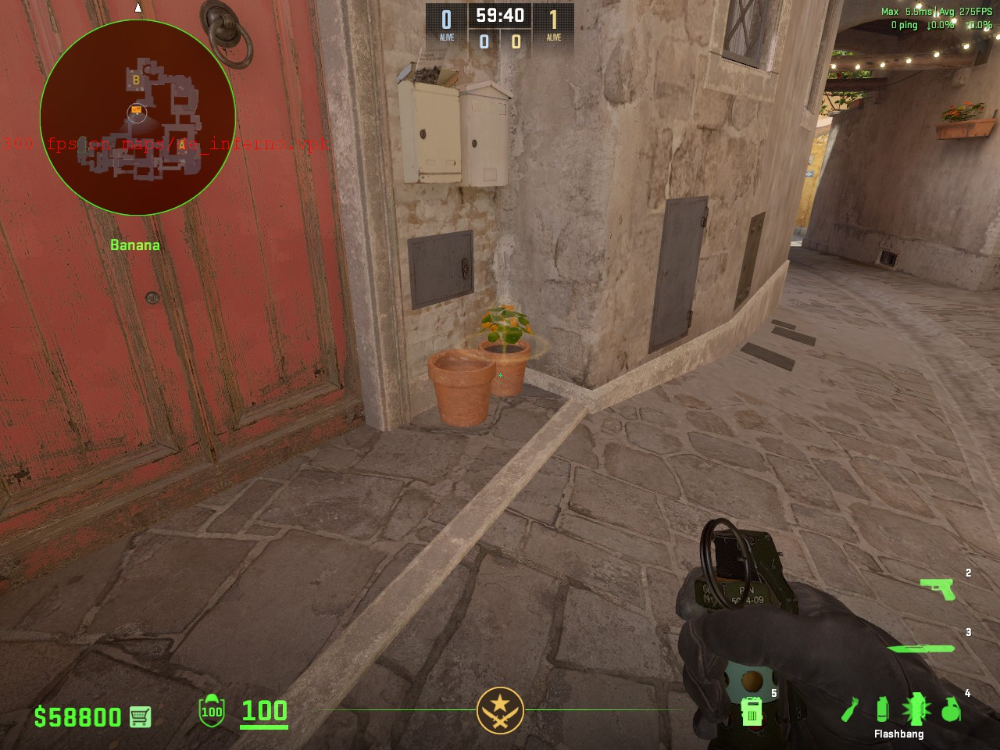
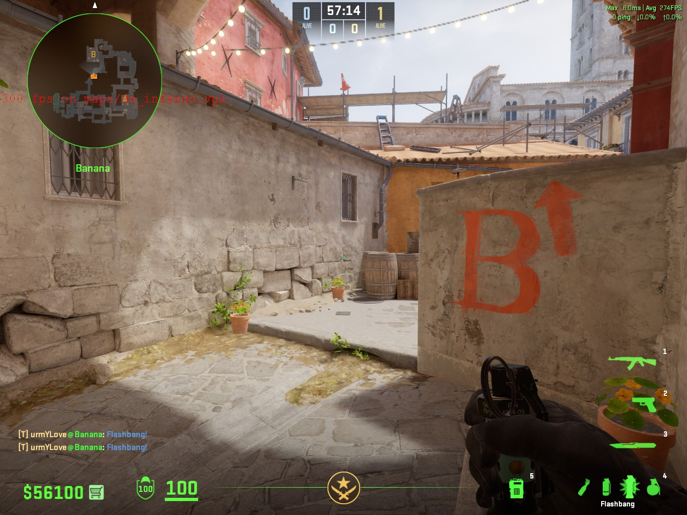
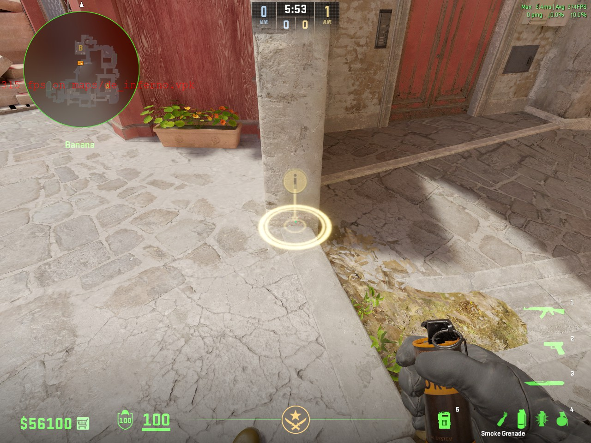
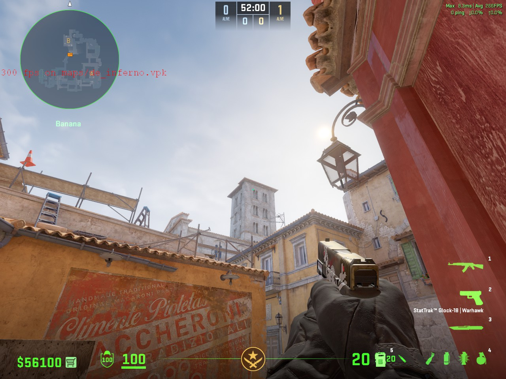
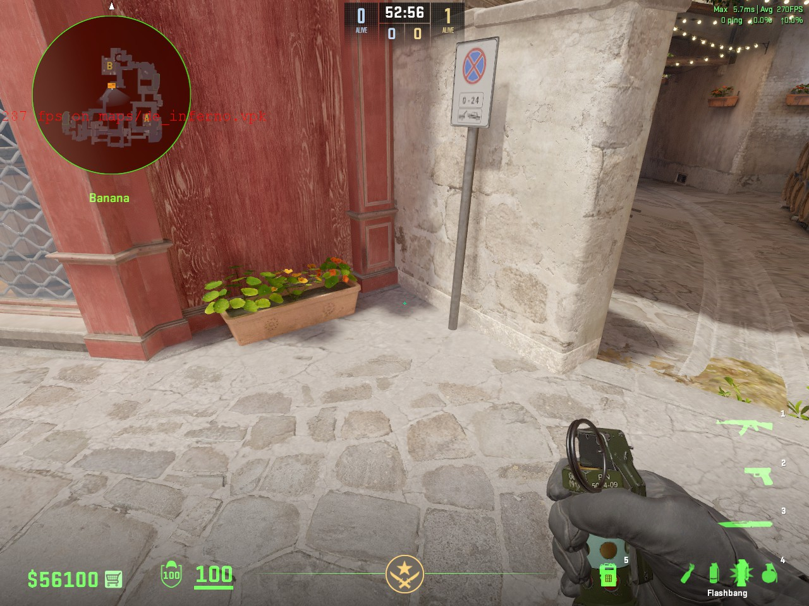
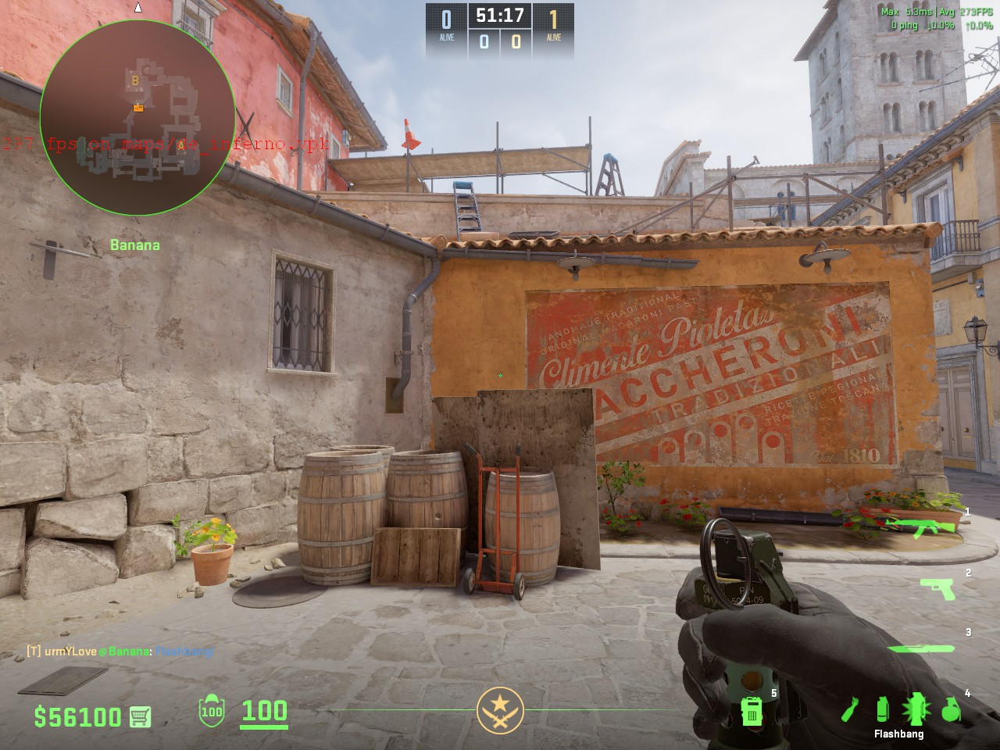
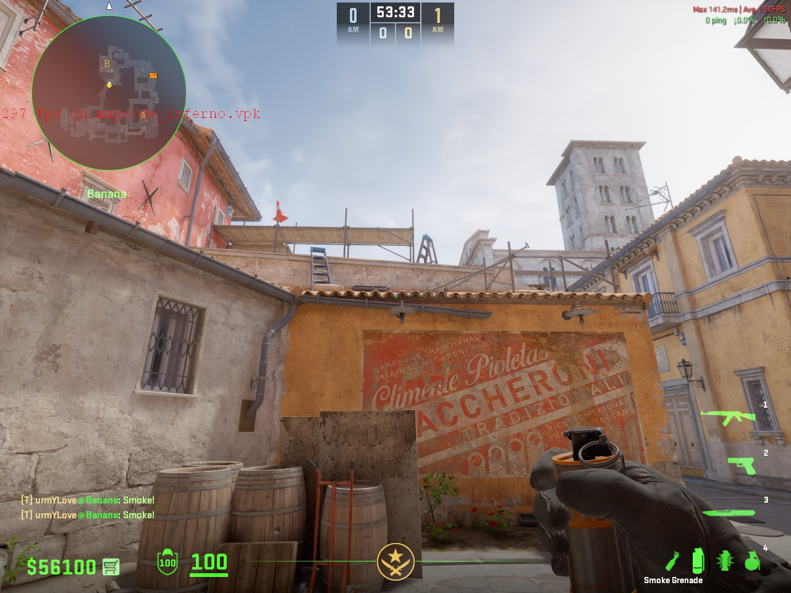
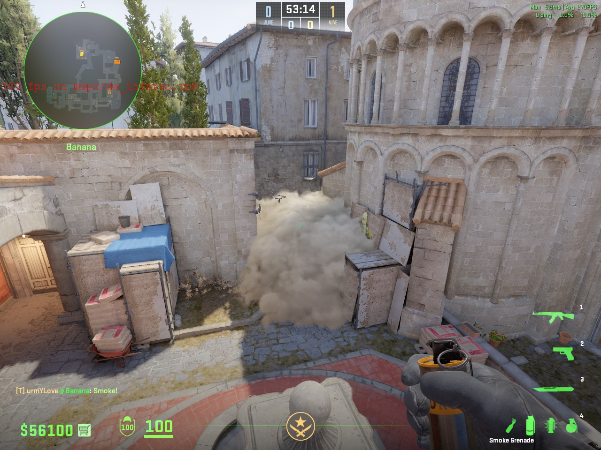

# 炼狱小镇

## 进攻道具

### B包包点闪（不白白墙队友）

此闪有概率白不到棺材。

**出手时机** 队友贴到白墙近点（即左边的墙）时，可以给这个闪，发起进攻的号角。配合队友进包点。

**作用** 本闪在喷泉的石柱后面爆开，可以白到死点以及包点内的敌人，但让队友不要拉出一箱，有可能走位不慎会吃白，可以让他听闪爆再拉出去，这个闪还能晃一下警家的CT

**注意事项** 本闪不会白三箱架点的敌人，请配合另一个包点闪

#### 站位

#### 瞄点

#### W与跳投一起按

### B包包点闪（白三箱以及包点）

**出手时机** 队友准备进入B包点可以使用这个闪白三箱枪位的敌人，配合攻破包点。

**作用** 白三箱直架

**注意事项** 本闪不白警家以及死点，请先丢白死点再丢这个白三箱的，因为这个闪无论怎么样都白不到队友，它是在屋顶上面爆开的

#### 站位

#### 瞄点

#### 直接左键投掷

### B包包点闪（白棺材以及包点内）

**出手时机** 队友准备进B包点的时候可以丢这个闪，但有可能会白队友，请让队友听闪爆出

**作用** 白棺材大狙，包点内基本所有架台下的枪位，但是不白三箱以及蹲在棺材里的敌人

#### 站位

#### 瞄点

#### 直接跳投

#### 棺材烟

**出手时机** 当棺材大狙枪准或者是队友进包点时，没有道具（比如闪）去处理棺材的枪位时，或者是快速下包

**作用** 满封棺材枪位，使对面难以配合包点形成交叉火力打你

#### 站位

#### 瞄点

#### 直接跳投

#### 效果

