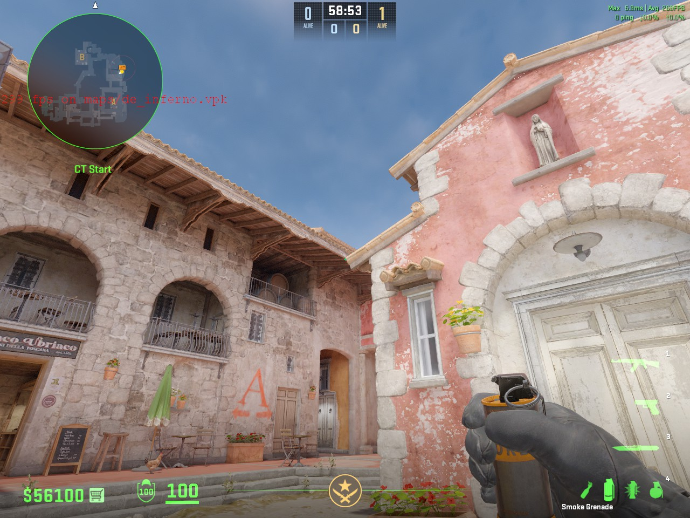

# 炼狱小镇

## 进攻道具

### B包包点闪（不白白墙队友）

此闪有概率白不到棺材。

**出手时机** 队友贴到白墙近点（即左边的墙）时，可以给这个闪，发起进攻的号角。配合队友进包点。

**作用** 本闪在喷泉的石柱后面爆开，可以白到死点以及包点内的敌人，但让队友不要拉出一箱，有可能走位不慎会吃白，可以让他听闪爆再拉出去，这个闪还能晃一下警家的CT

**注意事项** 本闪不会白三箱架点的敌人，请配合另一个包点闪

#### 站位

#### 瞄点

#### W与跳投一起按

### B包包点闪（白三箱以及包点）

**出手时机** 队友准备进入B包点可以使用这个闪白三箱枪位的敌人，配合攻破包点。

**作用** 白三箱直架

**注意事项** 本闪不白警家以及死点，请先丢白死点再丢这个白三箱的，因为这个闪无论怎么样都白不到队友，它是在屋顶上面爆开的

#### 站位

#### 瞄点

#### 直接左键投掷

### B包包点闪（白棺材以及包点内）

**出手时机** 队友准备进B包点的时候可以丢这个闪，但有可能会白队友，请让队友听闪爆出

**作用** 白棺材大狙，包点内基本所有架台下的枪位，但是不白三箱以及蹲在棺材里的敌人

#### 站位

#### 瞄点

#### 直接跳投

### 棺材烟

**出手时机** 当棺材大狙枪准或者是队友进包点时，没有道具（比如闪）去处理棺材的枪位时，或者是快速下包

**作用** 满封棺材枪位，使对面难以配合包点形成交叉火力打你

#### 站位

#### 瞄点

#### 直接跳投

#### 效果

### 台上烟

**出手时机** 这是属于进阶战术的一环，一般配合警家深烟，从教堂瓦解CT的防守，新手不建议使用

**作用** 封住包点CT的视野，可以扑警家

#### 站位

#### 瞄点

#### 直接左键投掷

### 警家深烟

**出手时机** 这是属于进阶战术的一环，一般配合台上烟，从教堂和警家形成一个包夹之势瓦解CT的防守，新手不建议使用

**作用** 封住警家后点的视野以及补防的CT的视野

#### 站位

#### 瞄点

#### 直接跳投

#### 效果

### 警家烟（进阶版）

**出手时机** 当集合爆弹打B或者假打时，可以封这个烟来阻碍在警家的CT

**作用** 封住警家的CT的视野，并且还能盖住花坛双架的CT的视野

#### 站位

#### 瞄点

#### 双键跳投

#### 效果

### 三箱火（满烧）

**出手时机** 集合爆弹打B时，最好在对面隔断烟散之后丢

**作用** 满烧三箱CT，减少一个难处理的枪位

#### 站位

#### 瞄点

#### 直接跳投即可

#### 效果

## 防守道具

### FAZE烟

**出手时机** 开局直接丢即可，一般可以叫队友配合前压中路给对面施压，或者是阻碍对面的视野，给到压力

**作用** 阻挡T在中路的视野，让其无法轻易的在中路给我方施压

#### 站位

 

 

 

 

#### 瞄点

 

 

 

 

#### 出生点位一到四为 【W + 跳投】 一起按，五和六为直接跳投

#### 效果

### 反清烟

**出手时机** 当失去香蕉道前点控制时，想要占领回蕉道前点，可以使用这个道具

**作用** 阻碍石板后补枪的T，配合反清火和反清闪，快速清空蕉道近点的敌人，从而让对面难以集合爆弹或者是让对面掉人

#### 站位

#### 瞄点

#### 直接投掷

#### 效果

### 反清火

**出手时机** 当失去香蕉道前点控制时，想要占领回蕉道前点，可以使用这个道具

**作用** 烧木桶附近的敌人，磨对面的血量或者是让对面暂时离开香蕉道近点

#### 站位

#### 瞄点

#### 直接跳投

#### 效果

### 蕉道近点火（烧石板后）

**出手时机** 当对面紧逼到蕉道前点，而且动静很大，建议配合中段烟和反清闪进行一个反清拿人头优势

**作用** 烧木桶附近的敌人（没有满烧），同时还能烧到石板后的敌人

#### 站位

#### 瞄点

#### 往前跑两到三步跳投

#### 效果

### 抢点闪/反清闪

**出手时机** 开局可以给这个闪，帮助队友拉出去香蕉道杀中段或者前点的敌人（建议给匪口烟），或者是中期反清对面中段的敌人

**作用** 白蕉道内的敌人（不白石板后和木桶）

#### 站位

#### 瞄点

#### 双键跳投

### 抢点闪/反清闪（远）

**出手时机** 开局可以给这个闪，帮助队友拉出去香蕉道杀中段或者前点的敌人（建议给匪口烟），或者是中期反清对面中段的敌人

**作用** 白蕉道内的敌人（不白石板后和木桶），这个闪比上个闪白的更远一点，但近点不白的区域会更多

#### 站位

#### 瞄点

#### 直接左键投掷

### 树位凹槽满烧火

**出手时机** 重新抢夺蕉道的时候使用，可以在中期使用这套道具，一定要确保前点安全的情况下

**作用** 烧出树位凹槽的敌人，配合闪光将其带走

#### 站位

#### 瞄点

#### 直接左键投掷

#### 效果

### A2楼火

**出手时机** 回合中期，在二楼或者其他位置的队友报点脚步多或者是B区没有对面的动静

**作用** 逼退A2近点的敌人，或者让对面被迫无奈踩住前点，配合闪光将其反刷

#### 站位

#### 瞄点

#### 直接跳投

#### 效果

### A2楼闪

**出手时机** 回合中期，或者是烧了A2火将其逼退并且近点没人，可以配合这个闪将A2楼清空

**作用** A2楼长廊的人基本全白，除了旋转楼梯位置架枪的T

#### 站位

#### 瞄点

#### 直接投掷