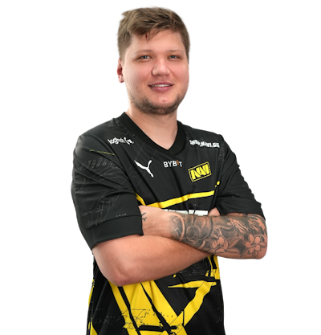
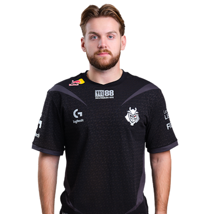
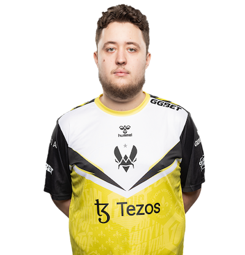
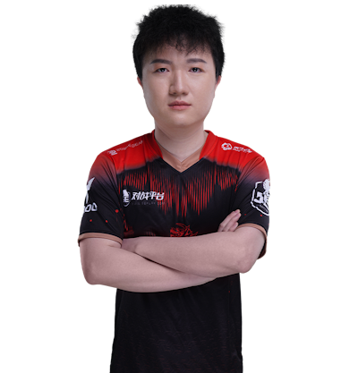

# 选手

本百科不记录他的荣誉以及冠军，请前往HLTV查询。

本百科只记录外号，以及他发挥失常的时候，应该怎么称呼，还有他的年龄。

## 传奇选手

### s1mple

作为**CSGO**（CS2的前身）的代名词之一，s1mple的实力毋庸置疑，在2018年和2021年曾一度统治了赛场，尤其是2021年，整支NAVI都统治了赛场。

但是随着年龄的增长，体重的增加，s1mple也逐渐下山。

#### 外号

+ 森破（ID音译）
+ 飞猪（肥猪的谐音）
+ 小森（特指年轻的s1mple，那时候还很瘦）
+ 榜一大哥（s1mple多次登顶top1，并且还在直播间给女主播刷礼物登上榜一）
+ 大飞老师（飞猪衍生而来）
+ 菲菲公主（飞猪衍生而来）
+ 简单男孩（ID意译）
+ 批破（发挥不好的时候）
+ people（批破的英文读法）

**年龄** 26岁（1998年生）

**所属战队** NAVI

**目前状态** 在役

### Niko

作为**CSGO**的代名词之一，Niko的实力毋庸置疑，但他的心态似乎有点不好，经常在关键局想要做事上头从而葬送局面，但是他在CSGO时期的步枪水平更是登封造极，因此也被封为世一步（世界第一步枪手）。

随着年龄的增长，他也渐渐下滑，尤其是枪法，但是他的预瞄仍然是独一档，这不可否认。

重要的是，他这么漫长的职业生涯，多次登上HLTV的TOP榜前五的位置，但却是没有Major。

他距离Major最近的一次就是2018年波士顿Major，如果他跟他的队伍能击杀掉炼狱小镇B包点三箱中的Stewie2k，那么他就有Major冠军了。

#### 外号

+ 妮寇（ID音译）
+ 虾哥（因为不少次在关键局变成软脚虾，从而得到的外号）
+ 波黑大虾（Niko是波黑人）
+ piko（发挥不好的时候）
+ 正面沙鹰王（因为他的沙鹰很准，但是由于在某个赛事，空掉了背身三枪沙鹰，从而得到正面沙鹰王的美誉）

**年龄** 27岁（1997年生）

**所属战队** G2

**目前状态** 在役

### ZywOo

这位更是重量级，作为法国最后的天之骄子，他出道仅仅一年就从s1mple手中夺得TOP1，更是被誉为天选之子，同时还全能（TOP1都是全能的），而且因为他的心态太好了，队友（特指队内指挥）经常让他打残局。

#### 外号

+ 载物（ID音译）
+ 废物（发挥不好的时候）
+ FywOo（废物的英文读法）
+ 泯牢薯（泯指泯然众人，牢指坐牢，薯就是大番薯，指状态不好且坐牢的大番薯）
+ 大番薯（像老夫子中的大番薯）

**年龄** 23岁（2001年生）

**所属战队** Vitality

**目前状态** 在役

## “传奇”选手

### advent

中国传奇指挥advent，过去的成就是伟大的，最近的战绩是失败的，由于枪法软，战术僵硬，导致风评很差。

#### 外号

+ 259（advent刚开始打职业时ID就叫259）
+ 9爷（一种“美称”，Astrails传奇五人组有个叫Xyp9x的，由于ID过于难念，大家叫他9爷，然后259也有9）

**年龄** 31岁

**所属战队** Tyloo

**目前状态** 在役