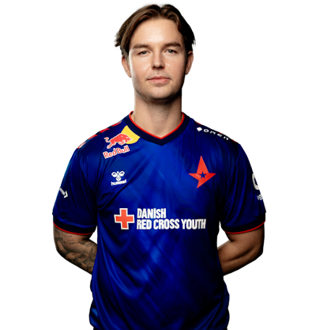
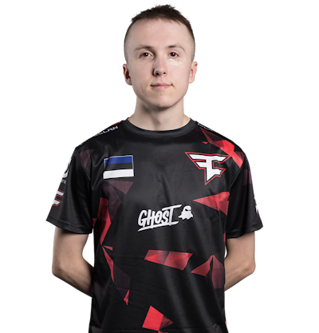
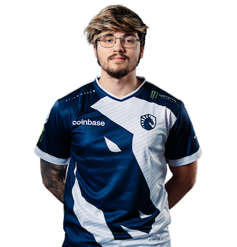
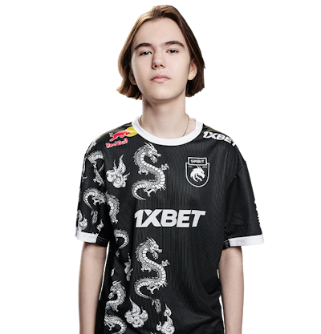
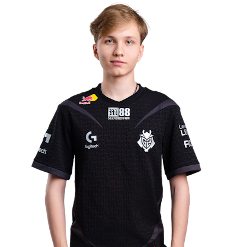
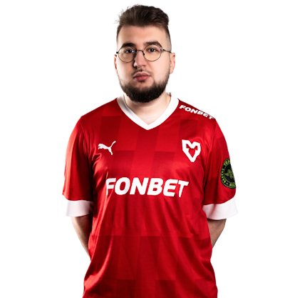

# 选手

本百科不记录他的荣誉以及冠军，请前往HLTV查询。

本百科只记录外号，以及他发挥失常的时候，应该怎么称呼，还有他的年龄。

## 传奇选手

### s1mple

作为**CSGO**（CS2的前身）的代名词之一，s1mple的实力毋庸置疑，在2018年和2021年曾一度统治了赛场，尤其是2021年，整支NAVI都统治了赛场。

但是随着年龄的增长，体重的增加，s1mple也逐渐下山。

#### 外号

+ 森破（ID音译）
+ 飞猪（肥猪的谐音）
+ 小森（特指年轻的s1mple，那时候还很瘦）
+ 榜一大哥（s1mple多次登顶top1，并且还在直播间给女主播刷礼物登上榜一）
+ 大飞老师（飞猪衍生而来）
+ 菲菲公主（飞猪衍生而来）
+ 简单男孩（ID意译）
+ 批破（发挥不好的时候）
+ people（批破的英文读法）

**年龄** 26岁（1998年生）

**所属战队** NAVI

**目前状态** 在役

### Niko

作为**CSGO**的代名词之一，Niko的实力毋庸置疑，但他的心态似乎有点不好，经常在关键局想要做事上头从而葬送局面，但是他在CSGO时期的步枪水平更是登封造极，因此也被封为世一步（世界第一步枪手）。

随着年龄的增长，他也渐渐下滑，尤其是枪法，但是他的预瞄仍然是独一档，这不可否认。

重要的是，他这么漫长的职业生涯，多次登上HLTV的TOP榜前五的位置，但却是没有Major。

他距离Major最近的一次就是2018年波士顿Major，如果他跟他的队伍能击杀掉炼狱小镇B包点三箱中的Stewie2k，那么他就有Major冠军了。

#### 外号

+ 妮寇（ID音译）
+ 虾哥（因为不少次在关键局变成软脚虾，从而得到的外号）
+ 波黑大虾（Niko是波黑人）
+ piko（发挥不好的时候）
+ 正面沙鹰王（因为他的沙鹰很准，但是由于在某个赛事，空掉了背身三枪沙鹰，从而得到正面沙鹰王的美誉）
+ 牢大（MOUZ战队早期一位特别强悍的步枪手，经常肩负起突破，打残局，补枪等基本所有人物的责任，简称坐牢，并且他是MOUZ第一位如此坐牢的步枪手，被称作牢大）

**年龄** 27岁（1997年生）

**所属战队** G2

**目前状态** 在役

### ZywOo

这位更是重量级，作为法国最后的天之骄子，他出道仅仅一年就从s1mple手中夺得TOP1，更是被誉为天选之子，同时还全能（TOP1都是全能的），而且因为他的心态太好了，队友（特指队内指挥）经常让他打残局。

#### 外号

+ 载物（ID音译）
+ 废物（发挥不好的时候）
+ FywOo（废物的英文读法）
+ 泯牢薯（泯指泯然众人，牢指坐牢，薯就是大番薯，指状态不好且坐牢的大番薯）
+ 大番薯（像老夫子中的大番薯）

**年龄** 23岁（2001年生）

**所属战队** Vitality

**目前状态** 在役

### device

作为Astrails传奇五人组的狙击手，device的强大无需置疑。拥有四座Major冠军，可谓是CSGO历史中最伟大和荣誉最多的选手之一。

但他自从2021年转会到NIP之后，由于发生了一些私事，从而隐退两年，复出的时候仍然强大，但由于版本更新，岁数渐长，他的实力也逐渐下降。

#### 外号

+ 阿汤哥（长相像演员汤姆·克鲁斯因而得名）
+ 设备（ID意译）
+ 菜汤（由阿汤哥衍生而来，更多是指发挥失常的时候）
+ 丹麦第一深情（因为感情问题从而隐退的device所得的外号）

**年龄** 28岁

**所属战队** Astrails

**目前状态** 在役

### ropz

现役的世界第一自由人，其意识出众并且枪法稳定且强大，因而经常扛起FaZe的责任，从而得到责任神这个称号。

因为他的意识很好，在早期曾被骂作是透视。

#### 外号

+ r6pz（因为他的位置，经常绕后偷掉敌方选手，被称作老六）
+ p3（发挥失常的时候，因为他是2023年TOP3，并且还有个选手叫es3tag，因为知名解说玩机器经常黑es3tag，称其为p3，然后ropz自然而然就被安上了这个外号）
+ 阴暗阳光小男孩（指ropz的外表看起来阳光，但却因为他的意识屡屡能偷到敌人背身，对于敌人来说就特别阴暗了）
+ 责任神（因为绕后，经常负责打残局，但是残局胜率很高，肩负起了赢比赛的大任，从而被叫做责任神）
+ 牢二（在Niko之后，ropz也经常在MOUZ坐牢，后面才到FaZe得以解脱 *似乎并没有解脱*，因而得名牢二）

**年龄** 24岁

**所属战队** FaZe Clan

**目前状态** 在役

### TwistZz

不仅作为加拿大最后的步枪手荣光，TwistZz还是唯一一位两次大满贯得主（Liquid一次，FaZe Clan一次）。

因为时神时鬼（发挥不稳定），TwistZz争议很大，但是因为他的颜值和发型，并且还有很精彩的操作（TwistZz的爆头率很高，因而观赏性十足），TwistZz的粉丝也特别多。

#### 外号

+ 总监（发型亮眼，并且还经常给别人理发，吹头 *指经常爆头*）
+ 推斯特贼贼（ID音译）
+ 披肩（发挥失常的时候被叫做披肩）
+ 强监（发挥神勇的时候被叫做强监）

**年龄** 24岁

**所属战队** Liquid

**目前状态** 在役

## “传奇”选手

### advent

中国传奇指挥advent，过去的成就是伟大的，最近的战绩是失败的，由于枪法软，战术僵硬，导致风评很差。

#### 外号

+ 259（advent刚开始打职业时ID就叫259）
+ 9爷（一种“美称”，Astrails传奇五人组有个叫Xyp9x的，由于ID过于难念，大家叫他9爷，然后259也有9）
+ inhuman（夸赞9爷的操作简直不像是人能打出来的一样）

**年龄** 31岁

**所属战队** Tyloo

**目前状态** 在役

## 新星

### donk

CS历史上出道表现最惊艳的新人，偶像是Niko，年仅17岁就有16000小时的游戏时长，定位反应天赋都非常顶级。

很多人误以为他是干拉，大拉去杀人的，殊不知Spirit（绿龙）的选手们在背后投入了多少道具，让他舒服的进点去杀人。

吃的资源非常多，但是吃了资源基本都可以做事的选手。

#### 外号

+ 南娘（不推荐，因为长相清秀）
+ ponk（发挥失误的时候）
+ 驴肉火锅（donk中文意思为驴）
+ 概念神（因为有人问，每把杀一个的概念神会怎么样，而donk在2024卡托维兹就是做到了每把起码杀一个。）

**年龄** 17岁

**所属战队** Spirit

**目前状态** 在役

### m0NESY

黄色闪光，NAVI青训提拔到G2（花了60w美元）的一个狙击很快的狙击手，喜欢看火影，因为出道年纪小，大家叫他小孩。

现在慢慢已经成长为独当一面的选手了。

#### 外号

+ 小孩
+ 老孩（小孩发挥失常的时候的称呼）
+ 小钱（m0NESY像money，故被叫做小钱）
+ 黄色闪光（小孩之前用的水门的头像，然后狙很快，被叫做黄色闪光）
+ 太子（NAVI的王位继承人，上一届太子是s1mple）

**年龄** 19岁

**所属战队** G2

**目前状态** 在役

### torzsi

老鼠的狙击手，因其神鬼二相性（有时候狙击特别准，有时候狙击特别空）因而导致他一直处于争议之中。

更是因为他的空枪容易害死队友，但是赛后数据却比较好看，因而经常被骂。

#### 外号

+ 拖子（ID音译）
+ 拖哥（拖子衍生）
+ 拖神（发挥神勇的时候，有时候反串也会用这个外号以示嘲讽）
+ 拖÷（发挥失常的时候，经常是拖÷形态）
+ 拖斯特÷÷（出处为Liquid队员TwistZz，因而仿照这个格式得名Torzsi÷÷）
+ 小载物（拖子出道的时候狙击特别惊艳，因而得到小载物这个美称）
+ 病载物（来源于小载物，因为拖子的狙击有时候打的非常难以入目，从而导致看起来像小载物带点大病一般）

**年龄** 21岁

**所属战队** MOUZ

**目前状态** 在役