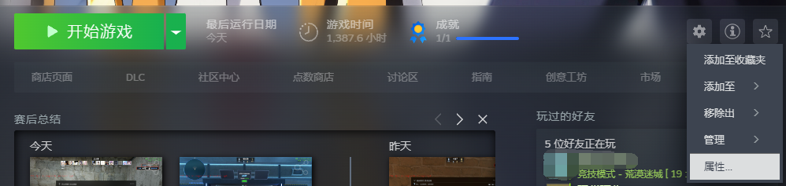
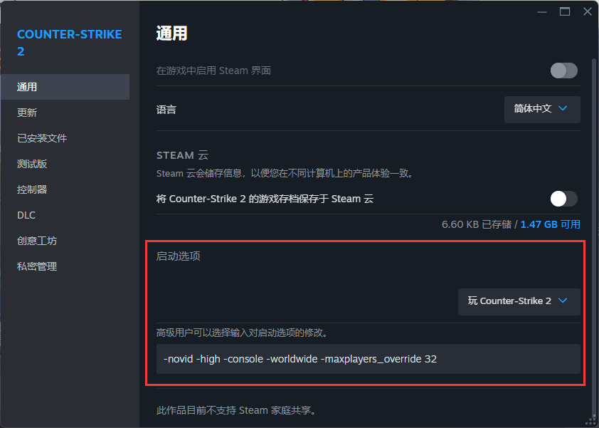
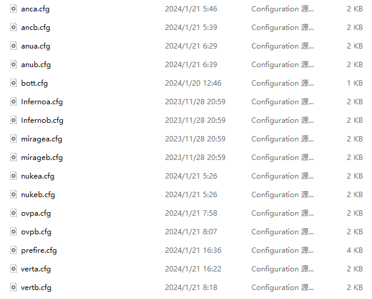
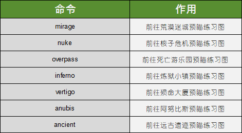

# 预瞄练习CFG

**注意：本CFG为外网搬运，国内暂时没有相应的视频教程，请参照本文档使用**

## 安装教程

**下载链接：** [提取码:VOOl](https://www.123pan.com/s/CQvwjv-bGBvd.html)

1. 打开`启动项`菜单

在启动项添加`-maxplayers_override 32`

2. 将下载的文件解压，并将其全部放入到`cfg`文件夹中

3. 启动游戏，开始游戏->练习，选择一张图进入，比如说荒漠迷城。

4. 打开控制台，执行命令`exec prefire`

## 命令对照表

### 预瞄练习图的预瞄练习地点

进入指定预瞄图后，输入指定预瞄图的指令既可开始预瞄练习

## 其他

本网站仅作搬运用途，如出现其他情况，与本网站无关

作品解释所有权归原作者 **@rafex78** 所有。

至于更改键位，请打开CFG文件夹中的prefire.cfg，然后进行更改