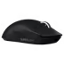

# m0NESY

## 鼠标设置



### 详细参数

+ [DPI](https://baike.baidu.com/item/%E9%BC%A0%E6%A0%87%E5%88%86%E8%BE%A8%E7%8E%87/1230193): 400
+ 灵敏度: 2
+ eDPI = DPI x 灵敏度: 800
+ 开镜灵敏度: 1
+ [鼠标回报率](https://baike.baidu.com/item/%E9%BC%A0%E6%A0%87%E5%9B%9E%E6%8A%A5%E7%8E%87/4562980): 2000
+ [系统设置灵敏度](https://mbd.baidu.com/newspage/data/dtlandingsuper?nid=dt_4647532271748526525): 6

## 准心

`CSGO-CeVsa-CaTAo-FfAfU-FZbX9-AvXsO`

请在`设置->游戏->准心->分享或导入`导入此串代码

## 手臂位置

```
viewmodel_fov 68; viewmodel_offset_x 2.5; viewmodel_offset_y 0; viewmodel_offset_z -1.5; viewmodel_presetpos 3; cl_usenewbob false;
```

请在`游戏内控制台`运行这串命令

## 启动参数

`无`

## 视频设置

+ 分辨率: 1280x960
+ 纵横比: [4:3拉伸](https://www.bilibili.com/video/BV1Ep4y1e77S)
+ 显示模式: 全屏
+ 亮度: 93%
+ 增强玩家对比度: 关
+ 等待垂直同步: 关
+ 多重采样抗锯齿模式: 8x MSAA
+ 全局阴影效果: 高
+ 模型/贴图细节: 低
+ 贴图过滤模式: 双线性
+ 光影细节: 低
+ 粒子效果: 低
+ 环境光遮蔽: 高
+ 高动态范围: 性能
+ Fidelity FX 超级分辨率: 已禁用（最高品质）
+ NVIDIA Reflex 低延迟: 禁用

### HUD设置

+ HUD缩放 1
+ HUD颜色 蓝色

### 雷达

+ 以玩家为中心: 是
+ 雷达是否旋转: 是
+ 切换计分板样式: 是
+ 雷达HUD大小: 0.91
+ 雷达地图缩放: 0.4

## 配置文件

[一键下载](https://prosettings.net/wp-content/uploads/m0nesy.zip?lastmod=2024-02-22+01%3A46%3A46)

将其解压后放入CFG文件夹即可使用m0NESY的设置

## 外设

+ 显示屏：ZOWIE XL2566K
+ 键盘：Logitech G PRO X TKL
+ 隔音耳机：Logitech G Pro X 头戴式
+ 鼠标垫：SteelSeries QcK Heavy
+ 游戏耳机：Logitech G333 黑色

## 电脑配置

+ CPU：Intel i9-12900K
+ 显卡：NVIDIA GeForce RTX 3080 Ti SUPRIM X