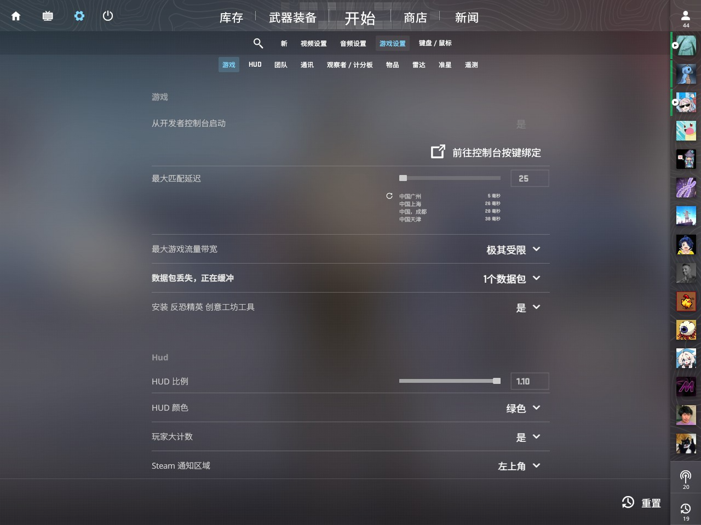
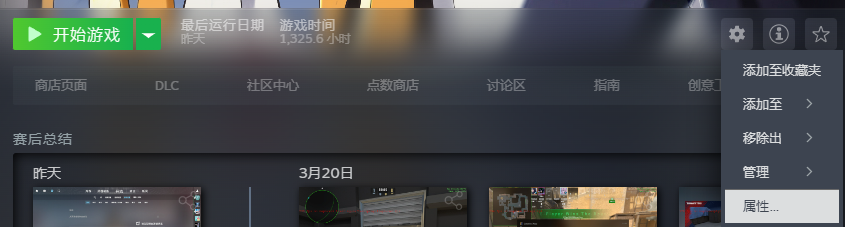
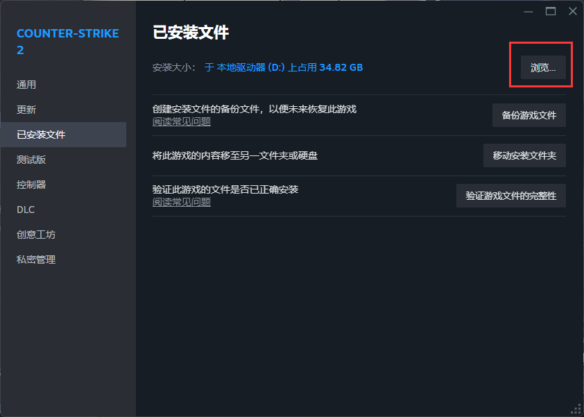

# 教程

不仅限于枪法，本百科还会教会你设置CFG以及调设备

## 基础准备工作

1. 启用游戏内控制台

请把你的**从开发者控制台启动**设置为**是**。

2. 打开`CFG`文件夹

然后依次打开以下文件夹：`game/csgo/cfg`。

该文件便是你存放CFG的文件夹。

3. 关于`autoexec.cfg`

这是一个在游戏启动时便会自动运行的CFG文件，可以理解为开机自动运行的文件。

如果你不想在启动项写入`+exec [你想要运行的CFG]`的话，就可以创建/编辑CFG文件夹中的`autoexec.cfg`，写入`exec [你想要运行的CFG]`即可。

## 作品收录

### 尝试制作第一个自己的CFG

**作者** iverins

**收录日期** 2024/3/26