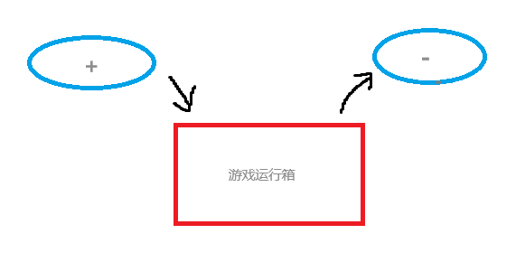

# ---
description: 使用记事本制作自己的第一个cfg。
---

# 尝试制作第一个自己的CFG吧

请注意，为了避免出现奇奇怪怪的BUG，CFG文件名统一设置为英文字母。

**目标:** 制作一个一键跳投CFG。

**成品:** 详见下面

## 准备工作

制作CFG，我们需要显示文件的后缀名。

如果你是Windows系统，请按照以下步骤来显示文件的后缀名。

[Windows 10系统显示后缀名](https://baijiahao.baidu.com/s?id=1760062502251551349&wfr=spider&for=pc)

[Windows 11系统显示后缀名](https://baijiahao.baidu.com/s?id=1786140869512908671&wfr=spider&for=pc)

请确保你在制作CFG之前启用了游戏内控制台。**（相关阅读：教程）**

## 正式开始

1. 我们在CS2的CFG文件夹中，新建一个记事本文件，就叫`tt`吧。

创建成功之后，应该是这样的：


然后用记事本打开它。

2. 紧接着，我们介绍一下以下三条指令。

```
bind [键位] [命令]
alias [名字] [命令]
+/-jump
```

这个`+/-`是什么意思呢？大家可以把CS2的命令运行看作一个箱子。

当前缀为`+`时，代表这个命令放进运行箱子里了。（开始运行）

然后等收到`-`的信号，或者是命令运行完了，就出箱。（结束运行）



`bind`翻译过来的意思是绑定，就是把命令绑定到指定键位上。（注意：如果是Caps Lock这种带有空格的键位，请使用`"`这个英语双引号把它括起来，比如这样`bind "Caps Lock" "say Niko作为一名8次荣登TOP20的选手，竟然没有一个Major冠军？"`）

`alias`代表的意思便是别名，简而言之，就是把命令取另一个名字。（注意：重启游戏之后，这个别名便会失效）

比如说，我这里有一串指令，叫做`say Niko作为一名8次荣登TOP20的选手，竟然没有一个Major冠军？`，就是公屏发送`Niko作为一名8次荣登TOP20的选手，竟然没有一个Major冠军？`这句话，那么我每次发都要输入这么多，太长了，我就可以在控制台或者在CFG中输入`alias piko "ay Niko作为一名8次荣登TOP20的选手，竟然没有一个Major冠军？"`，那么我们直接在控制台运行`piko`就可以运行`say Niko作为一名8次荣登TOP20的选手，竟然没有一个Major冠军？`这个命令了。

介绍完了这些，让我们正式开始编写跳投文件吧。

3. 首先，跳投顾名思义，是跳跟投一起执行。

所以我们用`alias`把跳跟投绑在一起，`;`作为分隔符。

`alias +jumpthrow "+jump;-attack"`

`-attack`就是`+attack`的出口，你跳投之前需要你按住鼠标的，那么`-attack`就是出口，把你按住鼠标的操作强制取消，就是投出去了。

`alias -jumpthrow "-jump"`

我们定义了一个入口`+jumpthrow`嘛，但是只有入口，游戏不知道他出口要干嘛，那就是`-jump`，让跳这个操作出去嘛，就完成了跳、投、不跳的过程。

我们把跳跟`-attack`命名到了`+jumpthrow`上面，那么接下来就要绑定键位了。

`bind "[键位]" "+jumpthrow"`我们把跳投入口绑定到一个键上，然后按下这个键就自动进入跳投入口，然后出口可以手动也可以自动（前文提到）。

然后保存这个记事本文件（Windows快捷键：Ctrl + S）。


4. 然后返回到CFG文件夹，毕竟是`.txt`记事本文件，CS是不加载的，他只加载`.cfg`的文件，所以我们需要手动更改后缀，把`tt.txt`改成`tt.cfg`


5. 然后我们可以在控制台输入`exec tt`来执行我们的跳投文件啦。

6. 由于每次重进游戏，`alias`的命令游戏会忘记，就需要我们重新输入`exec tt`来绑定，那么有没有什么快捷的方法呢？

方法肯定是有的，我们每次进入游戏时，让游戏自动执行一遍这个文件不就可以了吗？

我们可以把`exec tt`放入到`autoexec.cfg`里面，也可以通过修改启动项来加载。

我们打开属性，然后找到`通用`，在启动项加上`+exec tt`即可达到我们的目的了。


但如果，我的启动项已经有了其他东西，该怎么办呢？


那很简单，在最后面加个空格，然后输入`+exec tt`即可。


**Q：绑了一键跳投有什么用吗？**

A：一键跳投是**必须**要绑定的，虽然现在CS2放宽了跳投的判定范围，但还是有可能有一些道具，比如说需要D跟跳投一起按的VIP烟，在这种情况下，一键跳投就显得特别有优势了。