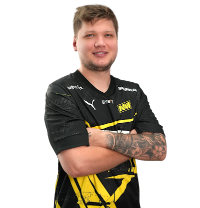
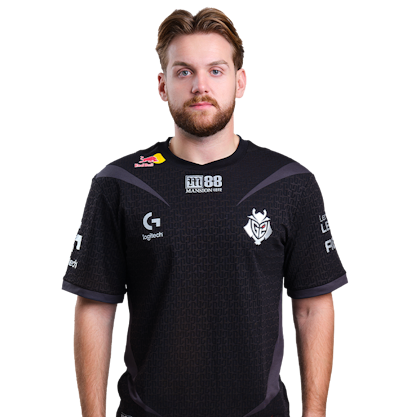

# 传奇选手

### s1mple

#### 绰号

简单男孩（ID意译），飞猪（因其体型），森破（ID音译），榜一大哥（因其三次HLTV评选top1，且给女主播刷礼物到榜一而得名），people（发挥差的时候，就说批了，所以称为批破）

#### 冠军

一共**18**个冠军。（仅统计Liquidpedia S级赛事冠军）

+ BLAST 春季总决赛 2022 冠军
+ BLAST 世界总决赛 2021 冠军
+ BLAST 秋季总决赛 2021 冠军
+ **PGL 斯德哥尔摩Major 2021 冠军**
+ EPL S14 冠军
+ IEM 科隆 2021 冠军
+ Dreamhack 春季大师赛 2021 冠军
+ IEM 卡托维兹 2021 冠军
+ ESL One 科隆 2018 冠军
+ CAC 2018 冠军
+ ESL One 纽约 2016 冠军
+ ...

#### 详细

**所属战队:** NAVI

**入选TOP20次数:** 8次（2016 #4，2017 #8，2018 #1，2019 #2，2020 #2，2021 #1，2022 #1，2023 #7）

**年龄:** 26岁

### Niko

#### 绰号

妮寇（ID音译），虾哥（决赛软脚虾，指他到决赛发挥失常），尼公子（经常去夜店而得名），波黑大虾（Niko来自波黑），41步（世界第一步枪手，世一步的同音），牢大（指先前在老鼠的第一任传奇步枪手，经常带飞队友，即坐牢而得名）

#### 冠军

一共**14**个冠军。（没有Major没有Major没有Major没有Major没有Major没有Major没有Major没有Major没有Major没有Major没有Major没有Major没有Major没有Major没有Major没有Major没有Major没有Major没有Major没有Major）

+ IEM 科隆 2023 冠军
+ IEM 卡托维兹 2023 冠军
+ BLAST 世界总决赛 2022 冠军
+ IEM 悉尼 2018 冠军
+ ESL One 纽约 2017 冠军
+ ...

#### 详细

**所属战队：** G2

**入选TOP20次数：** 8次（2016 #11，2017 #2，2018 #3，2019 #11，2020 #4，2021 #3，2022 #5，2023 #2）

**年龄:** 27岁