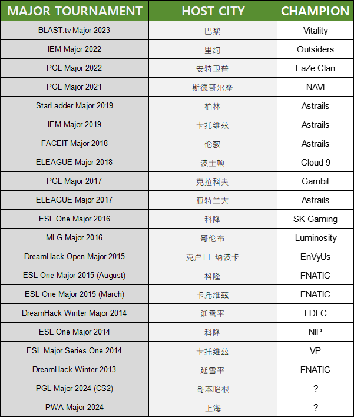

# 介绍

## 赛事介绍

其他赛事请参见子目录，这里只收录Valve官方举办的赛事。

### 常见赛制介绍

**BO1：**指一场定胜负

**BO3：**指三局两胜

涉及到**淘汰**或者**晋级**才会使用**BO3**。

### 瑞士轮

瑞士制在选择配位时最基本的一个原则是，挑选成绩相同或最相近的选手进行比赛。（即BU分接近）

第一轮比赛可通过抽签决定或者根据赛前排名决定。不管胜负如何，所有选手都进入下一轮。以后每一轮的配位，胜者对胜者，负者对负者，即根据此前的积分决定，积分相同或最相近的选手将相互对阵。当然前提是二者在前面的轮次中尚未交手过。

简单举例：

16支队伍，用瑞士轮，第一天，决出1-0组（8人）跟0-1组（8人），然后1-0组的8个人决出4个人晋升到2-0组，剩下4个败者则跌落到1-1组，0-1组的8个人决出4个人晋级到1-1组，剩下4个人跌落到0-2组。0-2组由于涉及到淘汰（输三轮淘汰，赢三轮晋级），故将会开启BO3，在这4个人之中，决出2个晋级到1-2组，剩下2个则淘汰。2-0组同理，决出2名胜者晋级到下一级，剩下2名跌落到2-1组。

### 单败赛

单败赛全程采用BO3。顾名思义，输了就淘汰。

### 双败赛

一般来说，双败赛指的是在单败赛的基础上，还有一次复活机会，如果复活机会都用完了，那么将会被淘汰。

### Major

**赛事等级：** S级

Major是Valve**唯一**承认的官方赛事，参加Major的选手将会获得印花分成（在CS游戏内商店购买的胶囊的收益将会分出50%给所有参加Major的队伍）。

无特殊情况，每年举办两届。

Major并非由Valve直接举办，而是由Valve外包给其他赛事方，比如PGL，ESL，BLAST等。

在Major中夺冠的五位选手，将会获得一枚冠军勋章（即 5年老兵 这种能在游戏中点开查看的勋章），上面刻有自2013起所有夺冠选手的名字。

**格式：** 赛事方 Major 年份

例如：BLAST.tv Major 2023（指的是2023年的由BLAST.tv赛事方举办的Major。）

**2013-2024年所有Major冠军及其队伍一览**

#### 详细介绍

Major分为三个阶段：揭幕赛（Opening Stage），正赛（Elimination Stage），季后赛（Playoff Stage）

**揭幕赛**

参加揭幕赛的队伍一共有16支队伍，以瑞士轮的方式决出8名队伍晋级到正赛。

**正赛**

原先的8支通过RMR晋级的队伍跟通过揭幕赛晋级的8支队伍，以瑞士轮的方式决出8名队伍晋级到季后赛。

**季后赛**

8名队伍以单败赛决出最终的Major冠军。冠军将会出独特的选手签名印花，收益全部归于冠军。