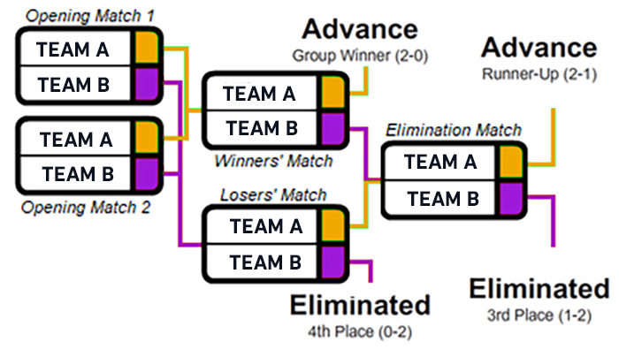

# S级赛事

Major也算是S级赛事，但此处不做收录。

## BLAST.tv 世界总决赛

本赛事由 **BLAST.tv** 举行，简称世决。

四大金牌S赛之一。

**奖金池**：$1,000,000

**参赛席位**：8

### 阶段

#### 小组赛阶段

使用GSL赛制（类似于双败淘汰）。简而言之，前两场比赛正常进行，然后获胜的队伍进入胜者组，落败的队伍进入败者组。

采用GSL赛制的小组赛历来都是以表格形式显示，类似于采用循环赛制的小组赛。在有四支队伍参加的小组赛中，理解哪些队伍晋级、哪些遭到淘汰非常简单，因为晋级与淘汰是直接从中间分的，即两支晋级，两支淘汰。

Advance代表晋级，Eliminated代表淘汰。

每组的前三名晋级季后赛，小组赛冠军晋级半决赛，亚军晋级四强（高种子），季军晋级四强（低种子）。

#### 季后赛阶段

使用单败淘汰赛制，一组的高种子队伍打另一组的低种子队伍。

## Thunderpick 世界冠军赛

本赛事由 **GAM3RS_X联合GRID** 举行。

**奖金池**：$850,000

**参赛席位**：16

直接单败淘汰决出冠军。

## IEM 科隆

本赛事由 **IEM** 举办，简称：科隆

因举办地在德国科隆而得名，为最大的赛事之一。

四大金牌S赛之一。

**奖金池**：$1,000,000

**参赛席位**：24

## IEM 卡托维兹

本赛事由 **IEM** 举办，简称：卡托

因举办地在波兰卡托维兹而得名，为最大的赛事之一。

四大金牌S赛之一。

**奖金池**：$1,000,000

**参赛席位**：24

## IEM 达拉斯

本赛事由 **IEM** 举办，简称：达拉斯

因举办地在美国德克萨斯州达拉斯市得名。

