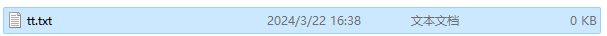
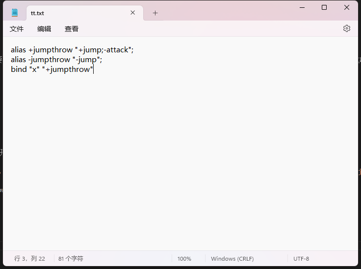
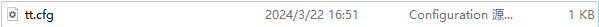
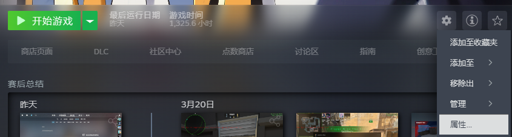
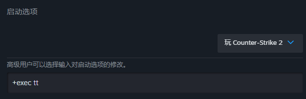
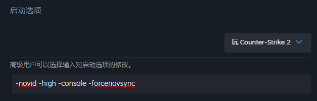
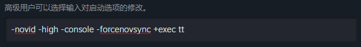
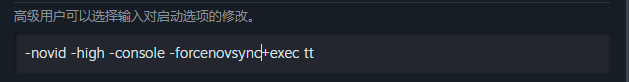

# 尝试制作第一个自己的CFG吧

请注意，为了避免出现奇奇怪怪的BUG，CFG文件名统一设置为英文字母。

**目标:** 制作一个一键跳投CFG。

**成品:** 详见下面

## 准备工作

制作CFG，我们需要显示文件的后缀名。

如果你是Windows系统，请按照以下步骤来显示文件的后缀名。

[Windows 10系统显示后缀名](https://baijiahao.baidu.com/s?id=1760062502251551349&wfr=spider&for=pc)

[Windows 11系统显示后缀名](https://baijiahao.baidu.com/s?id=1786140869512908671&wfr=spider&for=pc)

我们打开CS2的CFG文件夹。[打开CS2的CFG文件夹教程](README.md)。

还要[启用游戏内控制台](README.md)。

## 正式开始

1. 我们在CS2的CFG文件夹中，新建一个记事本文件，就叫`tt`吧。

创建成功之后，应该是这样的：



我们用记事本文件打开它。

2. 在此之前，你要了解以下三个指令。

```
bind [键位] [命令]
alias [名字] [命令]
+/-jump
```

`bind`意为绑定，即是把命令绑定到键位上。

`alias`意为别名，就简单来说，把命令取另一个名字。（重启游戏后失效）

`+/-jump`则是跳和松开跳。

比如说我这里有很长一串命令，`1145141919..................`，然后呢，我想要输入`hhha`就能运行这个命令，那我就在控制台输入`alias "hhha" "1145141919.................."`即可将这串长命令绑定到`hhha`上了，在控制台输入`hhha`也能运行。

```
alias +jumpthrow "+jump;-attack";
alias -jumpthrow "-jump";
bind "x" "+jumpthrow"
```

以上就是跳投代码的全部代码，让我们来解析一下吧。

`alias +jumpthrow "+jump;-attack";` 把+jumpthrow赋予了跳和-attack（松开开火）同时运行的含义。则你输入`+jumpthrow`会自动同时执行`+jump`和`-attack`。

`TIPS：命令在执行时，会自动调用+和-，你可以理解为命令是一个人，他上课的时候，也就是执行命令的时候，教室（即游戏内）会加（+）这个人，上完课了自动就减（-）这个人了。所以+jump是跳，-jump就是松开跳。`

`alias -jumpthorw "-jump";` 跳跟投执行完毕了，秉着严格的原则，在-jumpthrow中加个-jump，避免跳投出现BUG，一直跳。

`bind "X" "+jumpthrow"` 把跳投入口绑定到X键上，自动执行-jumpthorw。

记得点击保存（Ctrl + S），然后我们的文件就是这样啦。



3. 然后我们返回到CFG文件夹，找到`tt.txt`，因为CS只认`.cfg`的文件，`.txt`它是不认的，所以我们把`tt.txt`改成`tt.cfg`。



4. 然后我们可以在控制台输入`exec tt`来执行我们的跳投文件啦。

5. 由于每次重进游戏，`alias`的命令游戏会忘记，就需要我们重新输入`exec tt`来绑定，那么有没有什么快捷的方法呢？

方法肯定是有的，我们每次进入游戏时，都让他执行一遍这个文件不就可以了吗？

欸，这就是我们的启动选项，我们只需要在启动项加上`+exec tt`即可达到每次进入游戏时加载跳投啦。





但如果，我的启动项已经有了其他东西，该怎么办呢？



那很简单，在最后面加个空格，然后输入`+exec tt`即可。





**Q：为什么要加`""`？**

A：`""`而非`“”`，这是代表`""`包含的范围内都是这一条命令，就是防止出现`bind X say Hello`，不知道你是say Hello，还是say的情况。

**Q：`;`是什么意思？**

A：这是代表这一串命令已经完结了，充当一个句号的作用。不过你分行的话，可以忽略掉这个`;`。

**Q：绑了一键跳投有什么用吗？**

A：一键跳投是必须要绑定的，虽然现在CS2放宽了跳投的判定范围，但还是有可能有一些道具，比如说需要D跟跳投一起按的VIP烟，在这种情况下，一键跳投就显得特别有优势了。