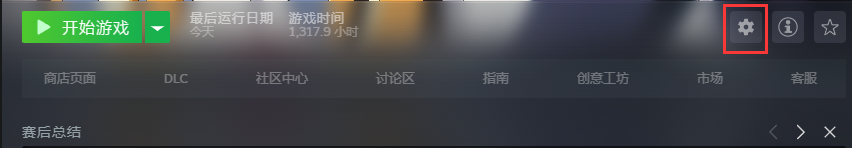
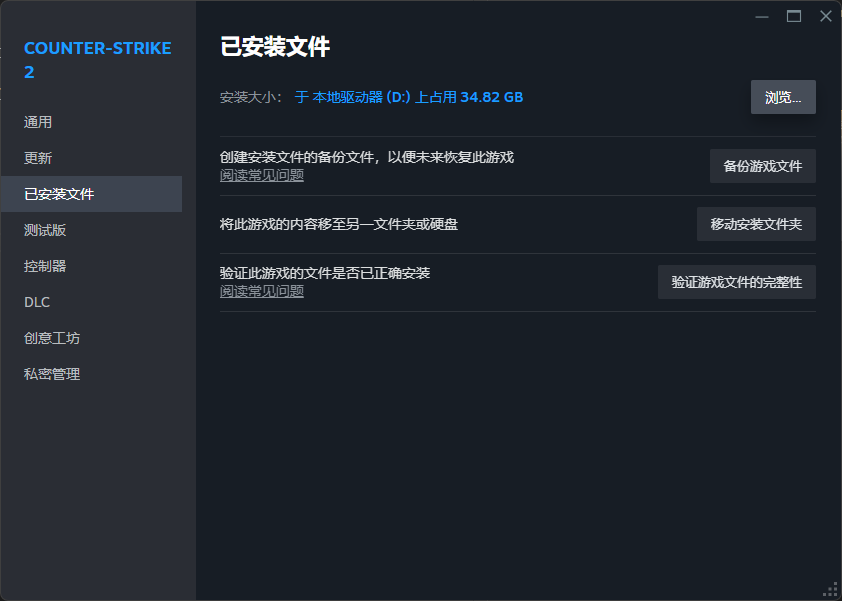

# 跑图CFG

**注意：此跑图CFG为本人自用，请将键位更改至你喜欢的键。**

## 安装教程

直接复制下载的文件即可。

**下载链接：** [提取码:JiOs](https://www.123pan.com/s/CQvwjv-EFBvd.html)

1. 打开CS2的**属性**菜单。



2. 点击**已安装文件**。



3. 点击**浏览...**。

4. 在新打开的文件夹中按照以下路径进入cfg文件夹。 `game/csgo/cfg`

5. 将复制的文件放入此处。

## 使用教程

进入一张练习图，（开始游戏->练习->休闲或者是竞技模式），然后在控制台中输入`exec pt`，稍等片刻即可。

#### 默认键位：

+ `F4` 飞行模式
+ `F8` 放大准星处
+ `F6` 加快时间流逝
+ `P` 重复上一个投掷物
+ `O` 对准丢出来的刀，可以将其变为骷髅匕首

#### 命令解析

CFG总览：

```
sv_cheats 1
mp_roundtime 60
mp_roundtime_defuse 60
mp_maxmoney 60000
mp_startmoney 60000
mp_freezetime 0
mp_buytime 9999
mp_buy_anywhere 1
sv_infinite_ammo 1
ammo_grenade_limit_total 5
bot_kick
mp_warmup_end
mp_restartgame 1
mp_ignore_round_win_conditions "1" 
bind F4 "noclip" 
bind F8 "toggle fov_cs_debug 25 0"
bind F6 "toggle host_timescale 1 1000"
bind P sv_rethrow_last_grenade
bind O "subclass_change 525"
mp_drop_knife_enable 1
mp_respawn_immunitytime 0
sv_regeneration_force_on 1
sv_grenade_trajectory_prac_pipreview 1
buddha 1
```

+ `sv_cheats 1` 开启作弊模式
+ `mp_roundtime 60` 将回合时间设置为 60 分钟
+ `mp_roundtime_defuse 60` 将回合结束后时间设置为 60 分钟
+ `mp_maxmoney 60000` 最大金钱设置为 60000
+ `mp_startmoney 60000` 起始金钱设置为 60000
+ `mp_freezetime 0` 开局冻结时间设置为 0 秒
+ `mp_buytime 9999` 购买时间设置为无限
+ `mp_buy_anywhere 1` 在任意处都可买枪
+ `sv_infinite_ammo 1` 无限子弹（设置为2为无限备弹）
+ `ammo_grenade_limit_total 5` 可装备 5 个投掷物
+ `bot_kick` 踢出BOT
+ `mp_warmup_end` 结束热身时间
+ `mp_restartgame 1` 重启该回合
+ `mp_ignore_round_win_conditions "1" ` 取消胜利条件（即回合永远不会结束）
+ `bind F4 "noclip"` `bind "键位" "命令"`是将一个键绑定为指定命令，比如说noclip是飞行，那么bind F4 noclip则是把F4绑定为飞行键。（仅在作弊模式启用情况下有效）
+ `bind F8 "toggle fov_cs_debug 25 0"` 同理，fov_cs_debug是更改视角的fov（一般可以说是视野范围）。
+ `mp_drop_knife_enable 1` 可以丢刀
+ `mp_respawn_immunitytime 0` 复活时间设置为 0
+ `sv_regeneration_force_on 1` 快速回血
+ `sv_grenade_trajectory_prac_pipreview 1` 显示投掷物的轨迹
+ `buddha 1` 锁血为1

## 常见问题

**Q：能不能改刀，我不想要骷髅匕首。**

A：可以的，只要把`subclass_change`后面的数字改一下即可。以下为具体的刀以及代码：

+ 500 - 刺刀
+ 503 - 海报短刀
+ 505 - 折叠刀
+ 506 - 穿肠刀
+ 507 - 爪子刀
+ 508 - M9刺刀
+ 509 - 猎杀者匕首
+ 512 - 弯刀
+ 514 - 鲍伊猎刀
+ 515 - 蝴蝶刀
+ 516 - 暗影双匕
+ 517 - 系绳匕首
+ 518 - 求生匕首
+ 519 - 熊刀
+ 520 - 折刀
+ 521 - 流浪者匕首
+ 522 - 短剑
+ 523 - 锯齿爪刀
+ 524 - 默认匕首
+ 525 - 骷髅匕首
+ 526 - 廓尔喀刀