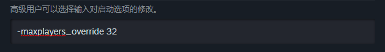
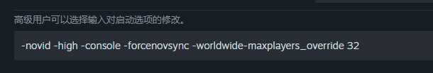
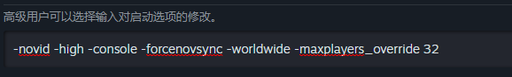
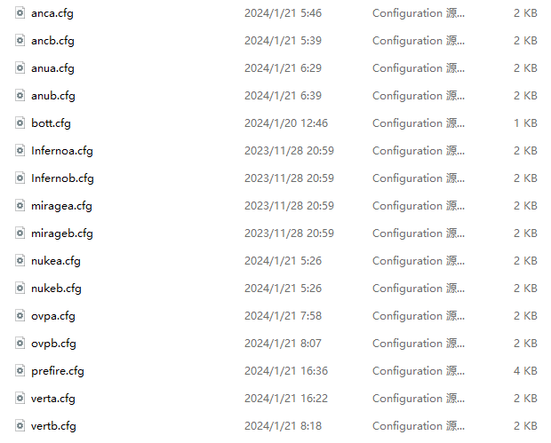
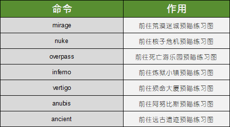

# 预瞄练习

**注意：本CFG为外网搬运，国内暂时没有相应的视频教程，请参照本文档使用**

## 安装教程

**下载链接：** [提取码:VOOl](https://www.123pan.com/s/CQvwjv-bGBvd.html)

1. 打开CS2的**属性**菜单。

2. 在启动项添加`-maxplayers_override 32`

如果你的启动项已经有了其他东西，比如这样：

3. 将下载的文件解压

4. 将这些文件全部拖入至CFG文件夹中

[如何打开CS2的CFG文件夹](README.md)

5. 启动游戏，开始游戏->练习，选择一张图进入，比如说荒漠迷城。

6. 打开控制台，执行命令`exec prefire`

**改键请查阅章节*教程***

7. 执行完第六步的命令之后，以下是命令以及键位对照表

你需要进入指定预瞄练习图才能开始预瞄练习

8. 这些命令需要你打开控制台，然后输入对应的命令即可开始预瞄练习

## 其他

本网站仅作搬运用途，如出现其他情况，与本网站无关

作品解释所有权归原作者 **@rafex78** 所有。

至于更改键位，请打开CFG文件夹中的prefire.cfg，然后进行更改