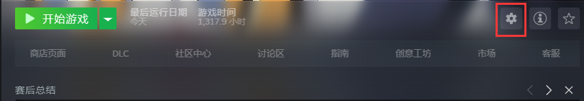
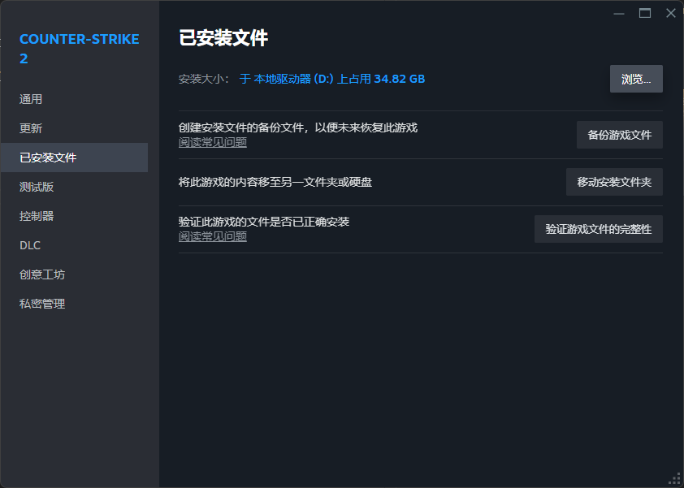
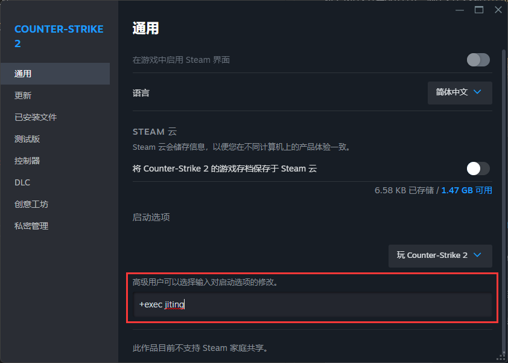
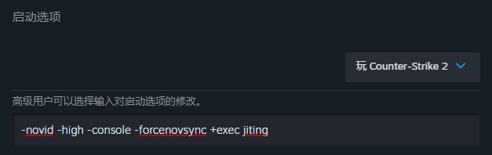
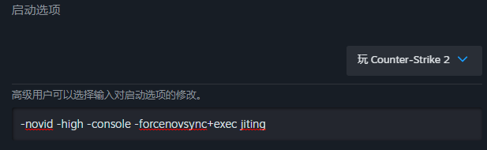

# 急停CFG

**注意：** 加载此CFG将会导致你的飞行模式以及爬梯出现*无法操控*等情况，请仔细斟酌后加载。

## 安装教程

将下载的文件解压并打开，选择文件夹内的`jiting.cfg`（有些电脑是`jiting`）并且复制该文件。

**下载链接：** [提取码: Ul08](https://www.123pan.com/s/CQvwjv-AFBvd.html)

1. 打开CS2的**属性**菜单。

2. 点击**已安装文件**。

3. 点击**浏览...**。

4. 在新打开的文件夹中按照以下路径进入cfg文件夹。 `game/csgo/cfg`

5. 将复制的文件放入此处。

6. 返回至第一步。

7. 在启动选项输入 `+exec jiting` 。（如果你已经有了其他启动参数，请在最后面复制这串启动项，并且如果前面没空格的话，记得加空格）

## 常见问题

**Q：我已经安装好了，为什么没用呢？**

A：请确保你的路径正确，并且确保启动选设置正确。还有一种可能就是你的移动不是WASD，您可以自行更改。

**Q：怎么看他有没有生效呢？**

A：您可以进入一个练习房，比如完美世界电竞平台的跑图训练，然后开启飞行模式，如果你按下了W等移动键，有出现反向飞行的情况，说明急停辅助CFG已经生效。

**Q：5E平台用不了CFG。**

A：请打开5e-box，在5e-box设置启动参数。同第七步一样。

**Q：会被封号吗？**

A：CFG是指令集，是Valve允许玩家使用的控制台指令，不会封号。

**Q：跑图的时候怎么关闭反向飞行？**

A：你可以在控制台输入 `huifu` 来恢复默认移动方式，或者通过切换键切换（默认为 `CapsLock`）

**Q：爬梯子的时候老是爬不上，该怎么办？**

A：参见此[视频](https://www.bilibili.com/video/BV1bB4y1B7mM/)