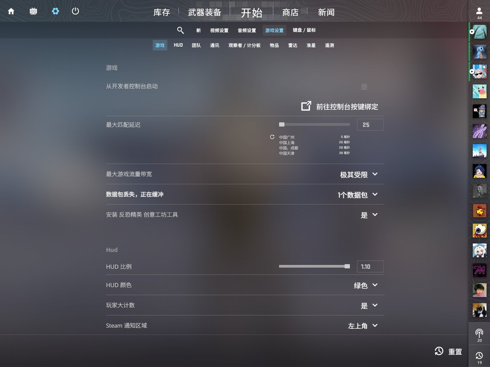

# 设置

## 控制台

在阅读本章节前，请先将控制台设置为开启。

打开CS2，请把你的**从开发者控制台启动**设置为**是**。

## 常见问题解决

#### 为什么我设置了开发者控制台启动，但却按“~”没有反应呢？

请单击Shift键后重试，遇到这种情况很可能是因为你的输入法为中文，请将其设置为英文输入法。

## 收录

以下记录已经收录的CFG文件。

#### CFG是什么？

CFG简称配置文件，把各种指令写入.cfg文件中可以快速加载、备份游戏设置。简单来说，就是有很多串命令，用CFG把他们集合起来，直接加载该CFG就能运行这些命令了。

#### 使用CFG会被封号吗？

当然不会，CFG是Valve官方放出的合法的指令集。

#### 那我怎么加载CFG？

你可以在控制台输入`exec [cfg文件名]`来加载CFG，或者是在启动项输入`+exec [cfg文件名]`来加载CFG。 

#### CFG存放在哪？

您可以点开CS2启动界面中的小齿轮，点击**属性**，点击**已安装文件**，点击**浏览**，然后按照以下路径打开文件夹：`game/csgo/cfg`。

该路径就是CFG存放的文件夹。

### 急停CFG

**创作者：** 藤原染色体/鸽子梨

**相关视频：** [BV1SG411y7HT](https://www.bilibili.com/video/BV1SG411y7HT)

**下载链接：** [提取码: Ul08](https://www.123pan.com/s/CQvwjv-AFBvd.html)

### IVERINS跑图CFG

**创作者：** IVERINS

**相关视频：** 无

**下载链接：** [提取码:JiOs](https://www.123pan.com/s/CQvwjv-EFBvd.html)