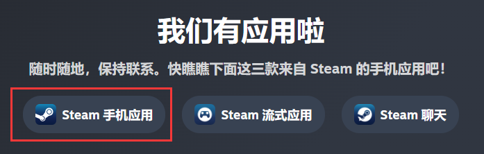

# 防诈骗指南

记住，陌生人加你不要理，发送的链接不要点，网吧登号用扫码，登完之后退设备，改密码，保护账号，从你我做起。

## 手机令牌的绑定

1. 在浏览器中下载**Steam Mobile**，绑定你的手机令牌。

[Steam Mobile下载](https://store.steampowered.com/mobile)

2. 绑定完手机令牌后，进入右下角的三条杠菜单中，选择`Setting -> Languages -> 简体中文`，就可以改成中文界面了。

3. 绑定手机令牌后，在网吧登陆后，退机时可以在已授权设备中取消授权，然后**更改密码**（这个特别重要）。

## 陌生人加Steam好友

像这种，陌生人加你好友，请不要理他，直接删掉，也不要有负罪心理，他们是机器人，就是为了骗你的饰品。

